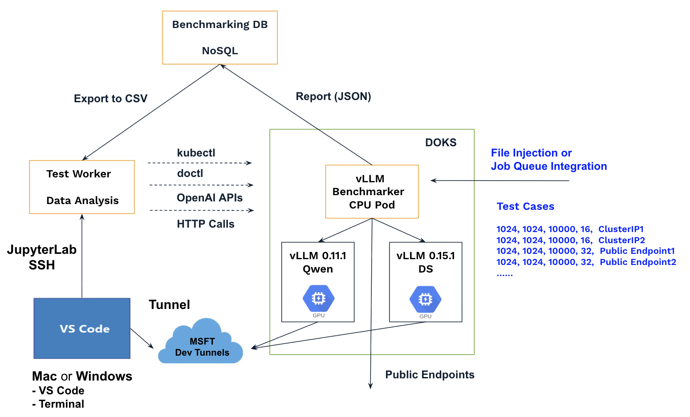

# vLLM Benchmarker

To deploy model deployment recipes, we need an automatic benchmarker to evaluate performance, enabling a timely and interactive workflow.

The vLLM Benchmarker runs as a CPU-only pod and can benchmark multiple vLLM services within the same DOKS cluster or via public endpoints.



[The test cases](vllm-benchmarker/test_cases.csv) must first be uploaded to the DOKS cluster and then mounted to the pod ([a queue-based solution](https://github.com/rxsalad/redis-queue-ai-inference) may be considered in the future, allowing dynamic injection of test cases). The model can be warmed up if a test case with num_requests = 1 is included.

Test results are uploaded to a MongoDB by the vLLM Benchmarker and subsequently [downloaded](vllm-benchmarker/benchmark-db-download.py) for further analysis. For implementation details, see [the repository - Benchmarking DB](https://github.com/rxsalad/benchmarking-database). After all test cases are completed, the Benchmarker will enter an infinite sleep state.

Refer to [the Dockerfile](vllm-benchmarker/Dockerfile) for the detailed implementation, which is based on the offical vLLM image and integrates VS Code Server to enable in-container development and debugging.

### Step 1: Deploy vLLM servers in DOKS

``` shell
kubectl apply -f 350-vllm-dev.yaml
kubectl apply -f 350-vllm-dev-service.yaml

kubectl delete -f 350-vllm-dev.yaml
kubectl delete -f 350-vllm-dev-service.yaml
```

Recode the service endpoints:

```
mi350-vllm-dev.default.svc.cluster.local
mi350-vllm-latest.default.svc.cluster.local
mi325-vllm-0111.default.svc.cluster.local
mi325-vllm-0151.default.svc.cluster.local
```

Manually verify and troubleshoot within the vLLM Pods if necessary:

``` shell
curl http://localhost:8000/v1/chat/completions   -H "Content-Type: application/json"   -d '{
    "model": "amd/DeepSeek-R1-MXFP4",
    "messages": [{"role": "user", "content": "who are you?"}]
  }'

curl http://mi350-vllm-latest.default.svc.cluster.local/v1/chat/completions   -H "Content-Type: application/json"   -d '{
    "model": "amd/DeepSeek-R1-MXFP4",
    "messages": [{"role": "user", "content": "who are you?"}]
  }'

vllm bench serve \
  --model "amd/DeepSeek-R1-MXFP4" \
  --dataset-name random \
  --random-input-len 8192 \
  --random-output-len 1024 \
  --request-rate 10000 \
  --num-prompts 4 \
  --ignore-eos \
  --trust-remote-code 

vllm bench serve \
  --base-url http://localhost:8000 \
  --model amd/DeepSeek-R1-MXFP4 \
  --dataset-name random \
  --random-input-len 1024 \
  --random-output-len 1024 \
  --request-rate 10000 \
  --num-prompts 16 \
  --ignore-eos \
  --trust-remote-code \
  --save-result \
  --result-dir . \
  --result-filename temp.json

vllm bench serve \
  --base-url http://mi350-vllm-dev.default.svc.cluster.local \
  --model amd/DeepSeek-R1-MXFP4 \
  --dataset-name random \
  --random-input-len 8192 \
  --random-output-len 1024 \
  --request-rate 10000 \
  --num-prompts 16 \
  --ignore-eos \
  --trust-remote-code \
  --save-result \
  --result-dir . \
  --result-filename temp.json
```

### Step 2: Prepare and upload the .env file

```
# Access to the Mongo DB
MDB_USERNAME=doadmin
MDB_PASSWORD=*************
MDB_HOST=*************
MDB_DATABASE=admin
MDB_BENCHMARK_DB=benchmark_db_2026

# A unique ID for the benchmark test
#TASK_ID=deepseek_r1_mxfp4_vllm_20260216
TASK_ID=Qwen3-235B-A22B-Instruct-2507-FP8_vllm_20260217

# Provide addtional info for the test
#OTHERS=doks-1.34.1-rocm-7.0.2-mi350x8-vllm-dev-dsfp4_1120
#OTHERS=doks-1.34.1-rocm-7.0.2-mi350x8-vllm-latest-0.15.1
OTHERS=doks-1.34.1-rocm-7.0.2-mi325x8-vllm

# The BASE_URL and MODEL will override those defined in the test cases.
# BASE_URL and MODEL should be removed if not provided.

#BASE_URL=http://mi350-vllm-dev.default.svc.cluster.local:80
#BASE_URL=http://mi350-vllm-latest.default.svc.cluster.local:80
#BASE_URL=http://mi325-vllm-0111.default.svc.cluster.local:80
#BASE_URL=http://mi325-vllm-0151.default.svc.cluster.local:80

#MODEL=amd/DeepSeek-R1-MXFP4
MODEL=Qwen/Qwen3-235B-A22B-Instruct-2507-FP8
```

Upload the .env file:

``` shell
kubectl create configmap bench-env --from-env-file=.env
kubectl describe configmap bench-env

kubectl delete configmap bench-env
```

### Step 3: Prepare and upload the test case file

[The default test case file](vllm-benchmarker/test_cases_default.csv) will be used if none are provided.

``` shell
kubectl create configmap test-cases-config --from-file=test_cases.csv
kubectl describe configmap test-cases-config

kubectl delete configmap test-cases-config
```

### Step 4: Run the vLLM Benchmarker


Tweak [the code](vllm-benchmarker/benchmarker.py) if necessary, then rebuild and push the image:

``` shell
docker image build -t docker.io/richardxgf/amd:vllm_benchmarker_1.0 -f Dockerfile .
docker push docker.io/richardxgf/amd:vllm_benchmarker_1.0
```

Deploy the vLLM Benchmarker pod and monitor its logs:

``` shell
kubectl apply -f vllm-benchmarker.yaml

kubectl get pods
kubectl exec -it <POD_NAME> -- /bin/bash
kubectl logs -f <POD_NAME>

kubectl delete -f vllm-benchmarker.yaml
```


### Step 5: Download and analyze the benchmark data

Run [the code](vllm-benchmarker/benchmark-db-download.py) to download the benchmark data using TASK_ID, which will be saved to the file TASK_ID.csv, such as [deepseek_r1_mxfp4_vllm_20260216.csv](DeepSeek-R1-MXFP4/deepseek_r1_mxfp4_vllm_20260216.csv) and [Qwen3-235B-A22B-Instruct-2507-FP8_vllm_20260217.csv](Qwen3-235B-A22B-Instruct-2507-FP8/Qwen3-235B-A22B-Instruct-2507-FP8_vllm_20260217.csv).

The start the JupyterLab to analyze the data:

``` shell
jupyter lab --no-browser --port=8888  --ip=* --allow-root 
```

See [the example](DeepSeek-R1-MXFP4/analysis.ipynb) for more details.


